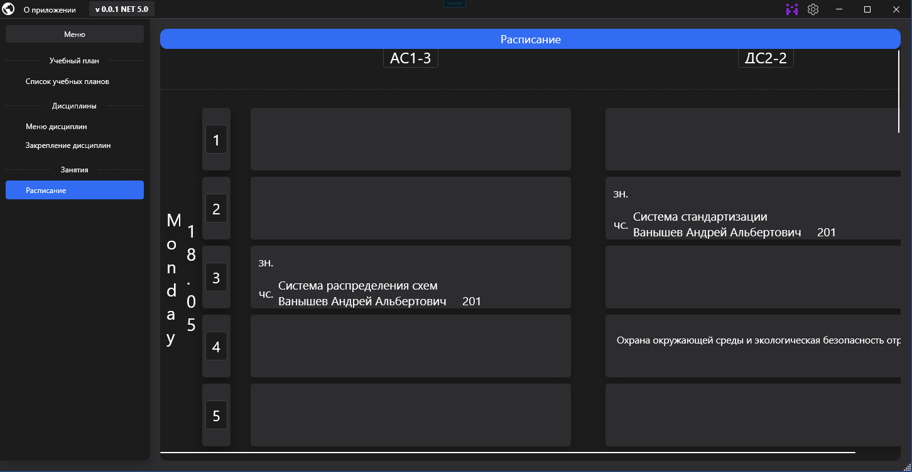
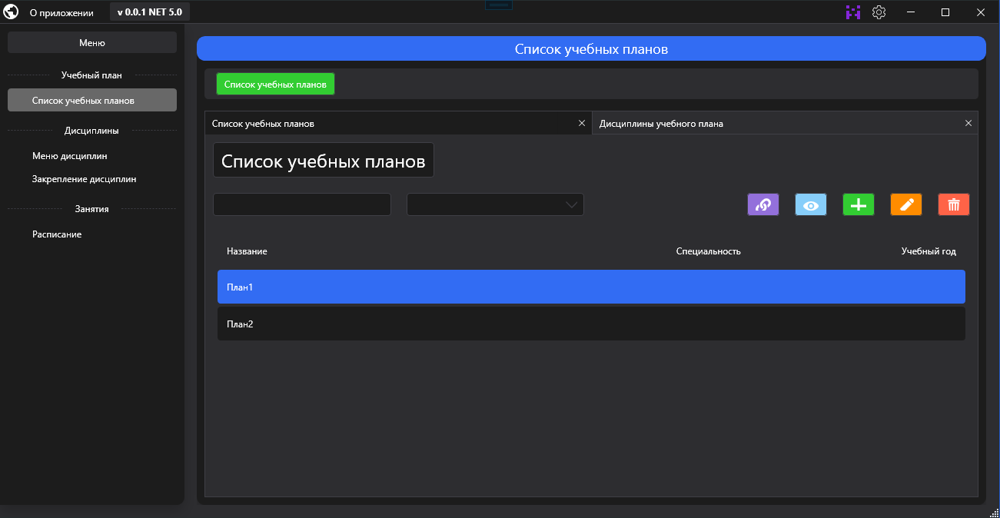

# EducationProcess


A project designed to correct a misunderstanding with getting a schedule from college, as well as replace routine work with automation

## Table of contents
* [Features](#features)
* [Using tools](#using-tools)
* [Illustrations](#illustrations)
* [Run The Project](#run-the-project)
* [Quickstart](#quickstart)
  * [Launch Api](#launch-api)
* [License](#license)


## Features

- Support for multiple departments is enabled
- View and interact with the college schedule
- Working with the education plan, as well as uploading it to an Excel spreadsheet
- Accounting of the conducted disciplines

> Note: not ready yet

## Using tools

- NET 5
- ASP.NET Core WEB Api
- WPF
- MySQL Community Server 8.0

## Illustrations

### WPF-Client
#### Schedule

#### Education Plan 


## Run The Project
You will need the following tools:

* [Visual Studio 2019](https://visualstudio.microsoft.com/downloads/)
* [.NET 5](https://dotnet.microsoft.com/download/dotnet/5.0)
* [Docker Desktop](https://www.docker.com/products/docker-desktop)


## Quickstart

### Launch Api
1. Clone the repository
2. At the ***src*** directory which include **docker-compose.yml** files, run below command:
```
docker-compose -f docker-compose.yml -f docker-compose.override.yml up -d
```

>Note: Be sure that 8000 port is free

3. Wait for docker compose finish
4. You can launch api as: http://localhost:8000/swagger/index.html

## License

[The MIT License (MIT)](https://mit-license.org/)

[(Back to top)](#educationprocess)